# JMeter-Citrix-plugin

This JMeter plugin enable load-testing Citrix XenApp exposed applications.

When working with this plugin, there will be 2 phases:

* The recording of the Citrix application
* The sampling of the created test plan

At the end of sampling, you can check the results in regular JMeter listeners.

---

## Usage

### Pre-Requisite

**Ensure you read and follow instructions of [PRE_REQUISITES](https://github.com/Blazemeter/CitrixPlugin/blob/master/PRE_REQUISITES.md)**

### Step

#### Use template Blazemeter Citrix Recording

A Citrix Recording Template is available to ease the script creation.
Click on Files → Templates... and select **Blazemeter Citrix Recording**.

The template will add below elements:

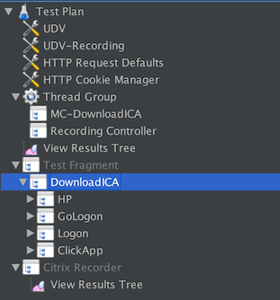

#### Update portal connection informations in it
You need then to update in **UDV**:

- citrix_portal_host to the Host name of your portal
- citrix_app_name to the name of the application you want to test

And in **UDV-Recording**:

- citrix_login to the login on portal
- citrix_passord to the password on portal

Note that since JMeter 5.1, the new parameterized template will make this step optional as those 4 informations will be required 
on template creation. 

If you do not want to use the template (this is not advised), you can add a Citrix Recorder by right-clicking on Test Plan → add → Non-Test Elements → Citrix Recorder.
Then, you will need to reference the Controller that contains the steps needed to download the application's ICA.

Here is what the recorder looks like : 

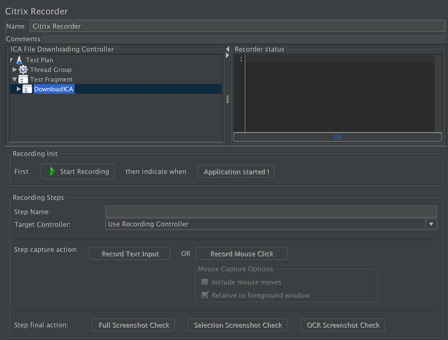

#### Recorder configuration : ICA Downloading

Before you can start a recording, you must reference in the Citrix Recorder the Controller that contains the sequence of HTTP Requests 
needed to download the ICA file. 
The Template already contains an example of a ICA Download and is referenced when you open it.

To reference it, you do it in the Tree of **ICA File Downloading Controller**. 

The referenced controller should ideally be inside a **Test Fragment** as you’ll also need to also reference it for regular 
sampling from **Module Controller** in the Thread Group that will run the test plan

#### Start Recorder
Once done, click on the **Start Recording** button. You will see in the **Recorder status** the progress.

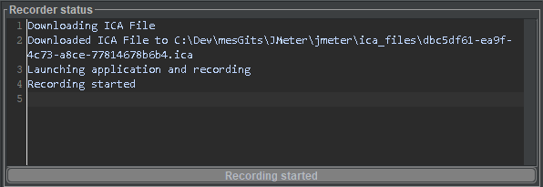

Then your Citrix application will launch, you can view the HTTP download steps in the **View Results Tree** located under Test Plan

#### Recording Actions

Once your citrix application has launched, click on the **Application Started** button to tell the plugin that the citrix application
is ready to be used. 
You will see a screenshot of the Citrix window, and you must then select to make a hash or ocr check (this will be discussed later).

From this point, you can use the **Record Text Input** and **Record Mouse Click** buttons :

**Record Text Input** allow you to record every text input on the citrix window while the button is activated. When you are done with the text recording,
just click again on the button and the associated samplers will be added in the JMeter tree and in the **View Results Tree** under **Citrix Recorder**.
If there are many Interactions, they will be grouped under a **Transaction Controller**. 
You can also choose to use one of the three following buttons to stop the text input capture : 

* **Full Screenshot Check** adds to the created sampler a hash of the entire citrix window that will be analyzed during sampling process.
* **Selection Screenshot Check** pops up a window with a screenshot of your citrix application. You can select an area of the screenshot that will be hashed and passed to the created sampler.
* **OCR Screenshot Check** works the same as the previous one but instead of hash, it is the text recognized by the OCR engine in the selected area that will be passed to the created sampler.

**Record Mouse Click** records mouse clicks. It works exactly like its **Record Text Input** counterpart. 
You can click again on it to stop the capture or use one of the three others buttons mentioned previously. 

One **Record Mouse Click** sequence will end in **one sampler per click created** on the JMeter test plan and in the **View Results Tree** under **Citrix Recorder**. If you checked the **Include mouse moves** box, plugin will create between each click samplers a sampler with **Mouse move informations**.

When you're done with recording, you can end the recording by clicking on the **Stop Recording** button. It will close your Citrix application **but not the citrix session**. 
You can also chose to end the recording by closing yourself the Citrix application inside the citrix window or by closing the citrix window itself.

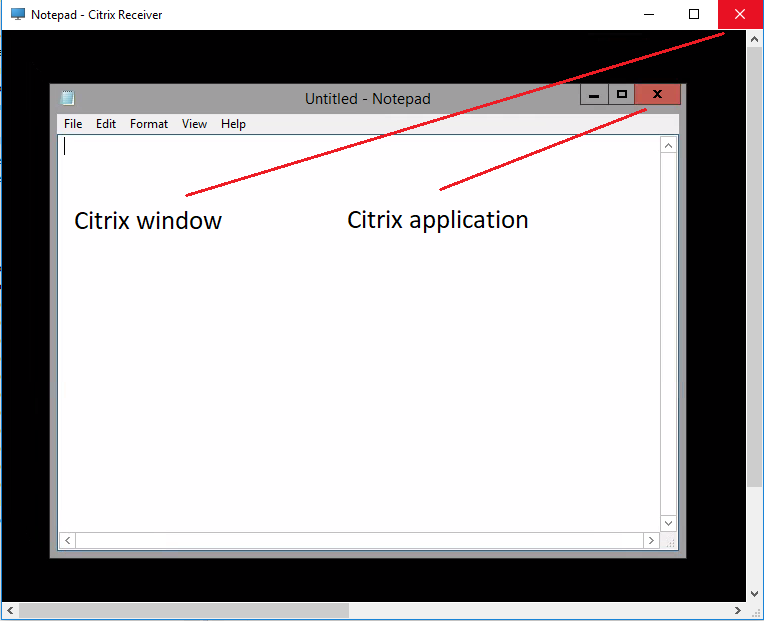

The Target Controller is a controller in your JMeter testPlan where the created samplers will be added during the recording.

#### Saving a recording

To save a Citrix Recording, the Template comes with a **View Results Tree** located under **Citrix Recorder**.

Just modify the **Filename** of the output file and recording will be saved in the XML file and be reloadable on demand in it as with regular HTTP Recording.

Please note that if you add one yourself, ensure you click on **Configure** button and check all fields except *Save Field Names (CSV)*

#### Samplers
In this section we will cover the 2 samplers this plugin adds to JMeter.

####Citrix Application Launcher####
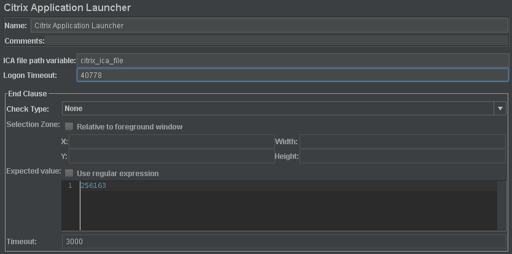

This sampler is added when you click on the **Application Started** button of the Citrix Recorder.

**ICA file path variable** contains the name of the variable (defaults to *citrix_ica_file*) that contains the path where the ica file is saved. 

If you use the template you can see it in Test Fragment -> DownloadICA -> ClickApp -> ClickApp-0 -> **ICA File Saver**. 
See below for **ICA File Saver** documentation.

**Timeout** field is computed by the **Citrix Recorder** and is the time between the launch of the citrix window and the moment the user clicks on the "Application Started" button. 
During sampling, it will be used as the maximum time to wait for application to start.

The End Clause panel will be explained in the **Citrix Interaction** section.

#### Citrix Interaction

The **Interaction Informations** panel contains instructions that will be sent to Citrix.

There are 4 different interaction types. On the above picture you can see the **Input Text** one.
The 4 interaction types are:

* **Input Text** : contains text you typed during the recording of a text input capture. Note that letters are always displayed as uppercase.
* **Key Sequence** : contains informations about control keys that are not letters or numbers (e.g maj, ctrl, alt buttons).
* **Mouse Click** : contains coordinates of one mouse click you made during a mouse click capture.
* **Mouse Sequence** : contains coordinates of your mouse while it was moving if you activated **Include mouse moves** during the recording.

**End Clause panel** :

This tells the Sampler that the expected state has been reached. For example, assume you have a sampler at a state where your application displays "Hello World !". The selection zone is the rectangular area you want to check, with our example you would put the "Hello World !" coordinates in your app.

**Check Type**: 

* **HASH** makes a hash of the selected area (makes a hash of the full screenshot if there are no coordinates in the selected area).
* **OCR** detects the text in the selected area.
* **HASH Changed** detects whether content of the selected area changes using hash computation.
* **OCR Changed** detects whether content of the selected area changes using text recognition.
* **Session Closed** detects whether the Citrix session is closed.
* **Window Exists** ensures a window with an expected title is present in Citrix session. 
* **Window Closed** ensures a window with an expected title is closed during the check.
* **Window Gets Foreground** ensures a window with an expected title gets the foreground during the check.
* **None** makes nothing, which means Sampler will run the interaction and consider result as OK.

**Selection Zone**:

* **Relative to foreground window**, check this option if you want the coordinates below to be relative to the foreground window during sampling.
* **X, Y, Width and Height** specify the screen area where the check is performed during sampling.

**Expected value**:

* **Use regular expression**, check this option if you want to use regular expression pattern matching instead of text equality.
* The textarea contains the expected value depending to the check you want to perform :
    * **HASH**, the hash value of the selected area.
    * **OCR**, the text contained in the selected area.
    * **Window Exists**, the title of the window that must be present.
    * **Window Closed**, the title of the window that must be closed during the check.
    * **Window Gets Foreground**, the title of the window that must get the foreground during the check. 

**Timeout**: The maximum time during which the end clause must be honored.

If the end clause state of the sampler is different from the one retrieved in the same area during the recording, the sampler will retry until timeout is reached. If timeout is exceeded and expected state is not reached, the sampler will be in failed state.

#### Assertions

##### Citrix Session State Assertion 

This one is very simple. Place it under a **Citrix Interaction** or **Citrix Application Launcher** sampler. 
It checks if the citrix session is open or closed. 
Just select one of the 2 options.

##### Citrix Assertion

It must be placed in the scope of **Citrix Interaction**/**Citrix Application Launcher** samplers. 
You can notice it is very similar to the **End Clause** panel of the samplers.

There are 3 differences:

* The sampler in its scope must have already completed the end clause or timeouted. Otherwise it would not take a screenshot on which the assertion works.
* You can't use the "None" check type (would mean the assertion does nothing).
* You can only use "HASH" or "OCR" because only these can work on a single screenshot .

After sampler has executed, the assertion compares the expected hashes/texts (separated by **|**) in the selected area with what it finds in the screenshot. 
If none matches, the sampler in scope is marked as failed.

Note you should almost never create an assertion by yourself. There is the **Citrix Interaction** renderer in **View Results Tree** 
that helps you generate them from sampling or Recording steps.
Click on any screenshot of the recorded steps. Select a rectangle and click on "Get hash" or "Get text".

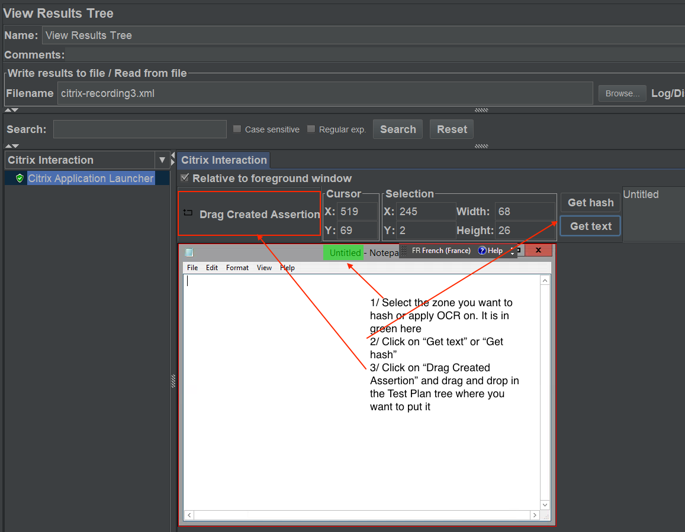

If you want to create assertion for this rectangle, drag from the **Drag Created Assertion** and drop under one of your samplers in the test plan.

#### Listeners

The plugin adds a **Listener** to JMeter called **ICA File Saver**. 
This listener must be added as a child of the **HTTP Request** that downloads the ICA file.

The configuration of this element is very simple:

* **ICA file path variable** is the name of the variable that contains the path to the ICA file downloaded for 1 thread. It defaults to **citrix_ica_file**. Note this variable name must be the same as the one defined in the **Citrix Application Launcher** element.
* **ICA files folder** is the folder where ICA files for all users are downloaded. You should cleanup this folder when starting a test

#### View Results Tree Renderer

The Citrix plugin provides a renderer **Citrix Interaction** that allows you to view the Citrix screenshot and create required OCR or Hash Assertions.

To use it, select it in **View Results Tree**:

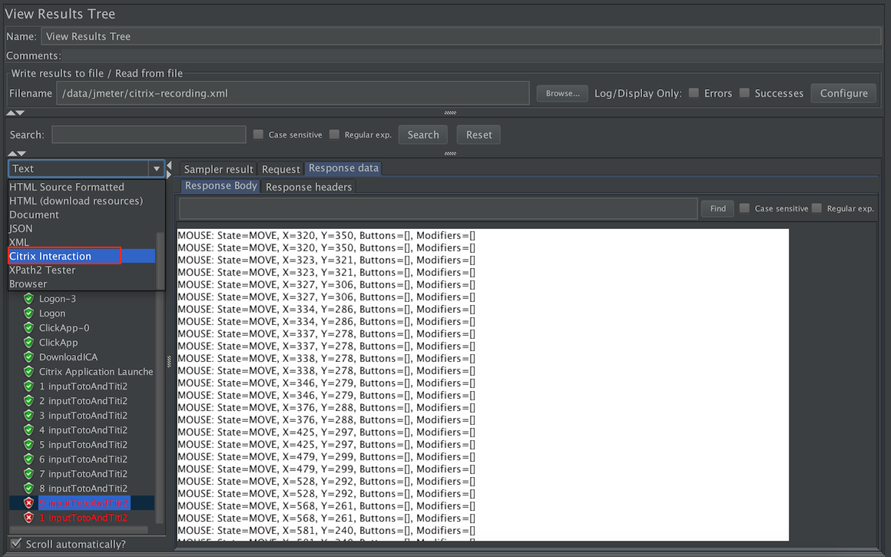

Then you can work with the screenshot:

#### Sampling

When the recording is done, click on the start button. It launches the sampling.
*Note for the load test you should use JMeter Non GUI mode.*

The sampling repeats the sequences you made during the recording by looking at the samplers informations.

If everything has been setup correctly, you will see your citrix application starting and replaying everything. 
At the end of the replay, the Citrix window closes even if you did not explicitly closed it in your recording.

You can see the results in the View Results Tree.

---

## Recording Example

Here we will make a recording on the Notepad application. We want to record the following sequences :

* The start of the Citrix window and Notepad application inside citrix
* Input text -> foo
* Clicks that lead us to the save dialog
* Input text > test (name of the file to save)
* Click on save
* Click on X (to close the Notepad)

To begin with, we create the template as described in the overview section:
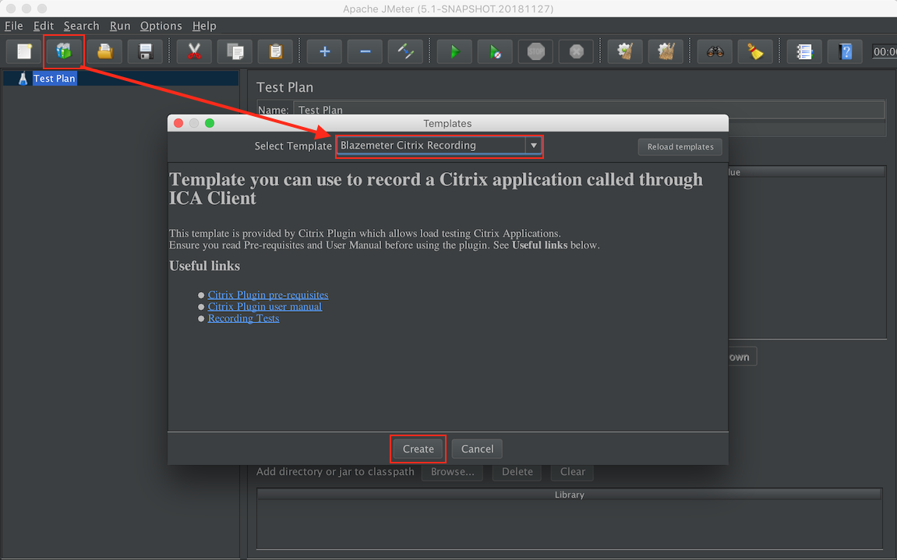

Once it's done, go to the **Citrix Recorder**, unfold node and select **View Results Tree**, fill in **Filename** field/ 
I select in my case *D:\notepadRecord\recording-citrix.xml*

Click on **Start Recording** (don't forget to select the DownloadICA step like on the image above) and wait for the citrix app and Notepad to launch.

Once application is available and ready to be used:

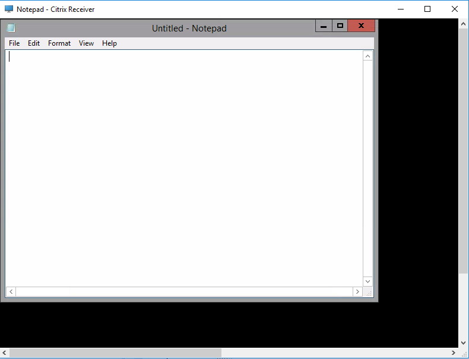

Click on the **Application started** button:

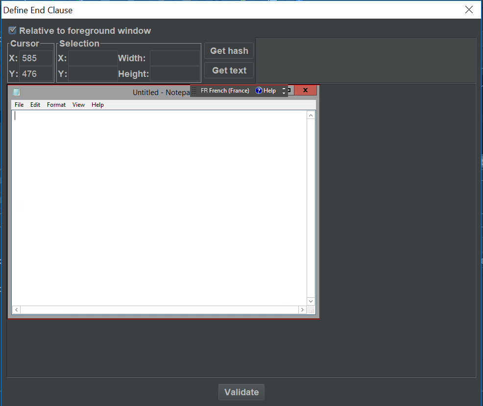

You can in this popup choose an area and make a hash/text but you can also directly validate. 
You can do as you wish here, it doesn't affect the recording at all.
It's important to select a meaningful area to check that is stable accross time.
Once you validate, check your testPlan/step view and notice you generated the corresponding sampler and step. 

The sampler generated by the **Application started** button is named **Citrix Application Launcher**, it's the only one that does not take the step name into consideration.
This sampler also contains the End Clause that is the result of the check you chose and configured:

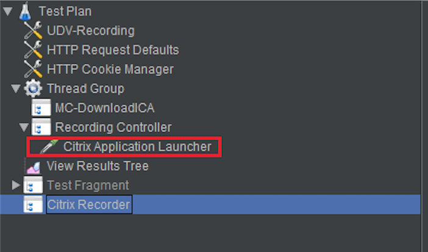

Now we want to record the "foo" text input we will type on the Notepad. Change the step name to *foo input*, click on **Record Text Input** 
and type foo in Notepad. 
Note that you can make clicks on the Notepad application to gain the focus, but it won't be recorded since **you only record text input**. 
When you end typing foo, click again on the text input button.

Now you have a second step in the step view and a second sampler in your plan. The generated sampler should looks like this:

Go back to the Citrix Recorder, type *Navigate To Save* in **Step name** and click on the **Record Mouse Click button**. 
Go to your Notepad app, click on *File* > click on *Save as*, go to the **Citrix Recorder** and click on the mouse click button.
Note that you created one step and 2 samplers inside a **Transaction Controller**.

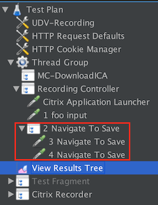

The generated samplers have the same click coordinates that the one in the step informations.

The following sequences until the end of the recording work the same way. The last sequence correspond to a click on "X" of the notepad app. When you do that, you also close the citrix client and a popup appears:

If you click on save, you will create the sampler and the step which closed the citrix application. 
A step created this way has no screenshot since this is the step that closed the application. 

With this example you should have something looking like this :

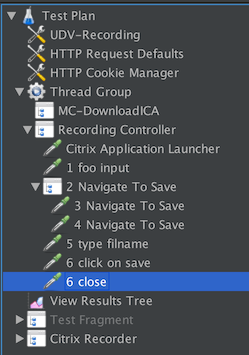

Enhance then your test plan with the **Citrix Assertions** and **Citrix Session State Assertion** required to have the expected states.

## Without template

If the template doesn't work for you as there might be some variations between portal versions, you should then use JMeter HTTP(S) Test Script Recorder to record the steps that lead to the download of the ICA. 
For more details, read [this](https://jmeter.apache.org/usermanual/jmeter_proxy_step_by_step.html) which explains how to make HTTP(S) recording.

To make it works you need to:

* Ensure that you do the required correlation for the **CsrfToken** token.
* Add **ICA File Saver** to the ICA download step

